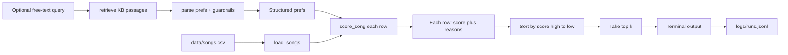

# 🎵 Applied AI Music Recommender (RAG + Guardrails + Evaluation)

## Project Summary

This project extends my **Module 3 project: _Music Recommender Simulation_** (a CLI content-based recommender that ranks songs from `data/songs.csv` using `genre`, `mood`, `energy`, and `likes_acoustic`).

The final system turns that baseline into a small **applied AI system**:
- **RAG preference parsing**: you can provide a free-text “vibe” query and the app retrieves relevant guidance from a small knowledge base (`knowledge_base/*.md`) before it converts your request into structured preferences.
- **Guardrails + logging**: parsed preferences are validated against the real catalog (only allowed `genre/mood`, `energy` clamped to `[0, 1]`) and each run is logged to `logs/runs.jsonl`.
- **Reliability evaluation**: `python -m src.eval` runs predefined cases and prints a pass/fail summary plus confidence scores.

---

## How The System Works

### Real platforms vs this simulator

Large services like Spotify or YouTube blend many signals. **Collaborative filtering** learns from *other users’* behavior: co-likes, skips, playlist co-occurrence, and sequence patterns (“people who kept this track also finished that album”). **Content-based filtering** uses *each item’s own attributes*: genre tags, mood labels, tempo, loudness/energy, acoustic instrumentation, or text embeddings from lyrics/metadata. Production systems mix both, plus exploration, freshness rules, and business constraints.

Main **data types** you see in industry: implicit feedback (skips, completes, replays), explicit feedback (likes, saves), social/graph signals (follows, shares), editorial metadata (genre, language), audio features (tempo, key, danceability), and contextual signals (time of day, workout vs focus).

### What this build prioritizes

This version is intentionally **content-only**: it never compares you to neighbors. It prioritizes **exact genre and mood string matches**, then **numeric closeness** on `energy`, then a light **acousticness fit** based on `likes_acoustic`. That is enough to separate “bright pop” from “lofi chill” when the CSV contains both.

**Song object / row features used in code:** `id`, `title`, `artist`, `genre`, `mood`, `energy`, `tempo_bpm`, `valence`, `danceability`, `acousticness` (loaded as typed numbers from CSV).

**User profile / prefs dictionary keys:** `genre`, `mood`, `energy` (target 0–1), and `likes_acoustic` (boolean). The `Song` and `UserProfile` dataclasses in `src/recommender.py` mirror the same idea for tests: `favorite_genre`, `favorite_mood`, `target_energy`, `likes_acoustic`.

**Scoring rule vs ranking rule:** the **scoring rule** maps *one* `(user, song)` pair to a number plus reasons. The **ranking rule** applies that judge to *every* song, then orders the list (here: `sorted(..., reverse=True)` and slice the first `k`). You need both because the score is local, but the product question is global (“what are my top picks right now?”).

**Why `sorted()` here:** `list.sort()` mutates the same list in place and returns `None`. `sorted()` builds a **new** ordered list and leaves the original untouched—handy when you still need the unsorted catalog for other prints or tests.

### Algorithm recipe (final)

Discrete matches (weights tunable via `RECOMMENDER_EXPERIMENT`—see Experiments):

- **Genre exact match:** `+2.0` points (halved to `+1.0` in experiment mode).
- **Mood exact match:** `+1.0` point.
- **Energy similarity:** `+ (1 - |song.energy - user.energy|) * w_e`, where `w_e` is `1.0` normally and `2.0` in experiment mode. Closer energies score higher; the user is not “rewarded” for always picking bigger numbers.
- **Acoustic fit:** `+ (1 - |song.acousticness - target|) * 0.5`, where `target` is `0.85` if `likes_acoustic` else `0.20`.

**Bias note:** genre outweighs mood on purpose, so the system can **over-prioritize genre** and keep intense pop (`Gym Hero`) high for listeners who share energy with party tracks even when their textual mood does not match—especially if the dataset lacks rows for a requested mood.

### Data flow (Mermaid)



If the diagram does not render in your Markdown preview, use [Mermaid Live Editor](https://mermaid.live) to validate, or view this file on GitHub (README Mermaid is supported there).

### Architecture image (PNG)

Save your exported system diagram PNG into `assets/` (recommended name: `assets/architecture.png`) so it’s visible in your GitHub portfolio.

---

## Example taste profile (Phase 2)

```python
DEFAULT_TASTE = {
    "genre": "pop",
    "mood": "happy",
    "energy": 0.85,
    "likes_acoustic": False,
}
```

This profile is wide enough to separate **intense rock** from **chill lofi** (different genre/mood gates), but narrow enough that energy ties still reorder near matches.

---

## Getting Started

### Setup

1. Create a virtual environment (recommended):

   ```bash
   python3 -m venv .venv
   source .venv/bin/activate      # macOS / Linux
   .venv\Scripts\activate         # Windows
   ```

2. Install dependencies:

   ```bash
   pip install -r requirements.txt
   ```

3. Run the app from the repository root:

   ```bash
   python -m src.main
   ```

   Run with **RAG parsing** (free-text vibe → structured prefs):

   ```bash
   python -m src.main --query "Upbeat synth-pop workout playlist"
   ```

   Optional **ranking mode** (stretch: compare strategies):

   ```bash
   python -m src.main --mode genre_first   # default
   python -m src.main --mode mood_first    # boosts mood match vs genre match
   ```

   You should see `Loaded songs: 18` followed by several labeled profile blocks. Recommendations print as a **`tabulate`** table (rank, title, artist, genre, mood, score, reasons).

### Running Tests

```bash
pytest
```

### Reliability / Evaluation script

Run the evaluation harness (predefined cases + confidence scoring):

```bash
python -m src.eval
```

If `pytest` cannot import `src`, run from the repo root (a small `conftest.py` adds the project root to `sys.path`).

---

## Terminal output (for screenshots)

Terminal captures live in `screenshots/` and are embedded below. Each shows the current **`tabulate`** output (titles, scores, and reasons in the table).

| Profile | File |
| --- | --- |
| High-Energy Pop | `screenshots/a.png` |
| Chill Lofi | `screenshots/b.png` |
| Deep Intense Rock | `screenshots/c.png` |
| Adversarial high energy + sad mood | `screenshots/d.png` |
| Adversarial metal + relaxed | `screenshots/e.png` |


### Captured CLI excerpt (Profile A)

```
Loading songs from data/songs.csv...
Loaded songs: 18
...
1. Sunrise City — Neon Echo (pop, happy)
   Score: 4.460
   Reasons: genre match (+2.0); mood match (+1.0); energy closeness (+0.97; gap=0.03); acoustic fit (+0.49; target=0.20)
```

---

## Experiments You Tried

**Weight shift (assigned experiment):** export `RECOMMENDER_EXPERIMENT=1` before running Python. Genre match drops from `+2.0` to `+1.0`, and the energy similarity multiplier doubles (`1.0 → 2.0`). On the high-energy pop profile, *Sunrise City* stayed first, but runners-up tightened around energy—showing the knob changes *ordering* among partial matches more than it invents new understanding.

**Stretch — two ranking modes:** run the same profiles with `--mode genre_first` vs `--mode mood_first` and compare the printed tables; mood-first raises the value of mood matches in the score breakdown (see `score_weights` in `src/recommender.py`).

**Stretch — tabulate output:** results are rendered with the `tabulate` package so each row includes wrapped **Reasons** next to the score (see `src/main.py`).

**What was not automated here:** temporarily commenting out the mood check (a second valid experiment). Doing so would lift mood-agnostic ties; if you try it locally, diff the printed top 5 against baseline.

---

## Limitations and Risks

See the full write-up in [**model_card.md**](model_card.md), especially the **Limitations and Bias** and **Evaluation** sections. Short version: tiny catalog, no collaborative signal, and exact string moods mean **missing moods behave like silent bias**.

---

## Reflection pointers

- Detailed pairwise profile commentary: [`reflection.md`](reflection.md)
- Structured model documentation: [`model_card.md`](model_card.md)

---

## Sample Interactions (end-to-end)

### Example 1 — RAG query

```bash
python -m src.main --query "Upbeat synth-pop workout playlist"
```

Expected behavior: the system retrieves KB guidance, parses prefs (e.g., `genre=pop`, `mood=happy`, `energy≈0.9`), then prints a ranked table and logs the run to `logs/runs.jsonl`.

### Example 2 — Baseline profiles (no query)

```bash
python -m src.main --mode mood_first
```

Expected behavior: prints the built-in profiles (A–E) using the baseline scoring + the selected ranking mode.

### Example 3 — Reliability evaluation

```bash
python -m src.eval
```

Expected behavior: prints JSON with per-case pass/fail, confidence scores, and top-3 recommendations.

---

## Design Decisions (high-level)

- **Why a tiny KB + TF-IDF retrieval**: the project is meant to be reproducible and runnable locally; markdown docs + simple retrieval make the RAG behavior observable and testable.
- **Why guardrails are catalog-aware**: the recommender only works when `genre/mood` match the dataset, so validation defaults invalid values rather than failing silently.
- **Trade-off**: TF-IDF retrieval is not semantic embedding search; it is simpler and transparent, but can miss paraphrases.

---

## Testing Summary

- `pytest`: core recommender tests + RAG preference parsing tests.
- `src.eval`: a small harness that runs predefined queries and reports **pass/fail** plus **confidence**.

---

## Reflection & Ethics

- **Limitations / biases**: the catalog is tiny and labels are coarse; missing moods/genres behave like “silent bias” because the system must default to available labels.
- **Misuse + mitigation**: free-text inputs could be used to probe the system; guardrails constrain outputs to known-safe labels, and logs make behavior auditable.
- **What surprised me in reliability testing**: retrieval chunking and KB phrasing can strongly affect whether the parser extracts mood vs genre, even when the baseline recommender is stable.
- **Collaboration with AI**: one helpful suggestion was adding catalog-aware guardrails (preventing invalid labels). One flawed suggestion was overly-fragmented chunking for retrieval; it reduced recall until I adjusted chunk boundaries.
